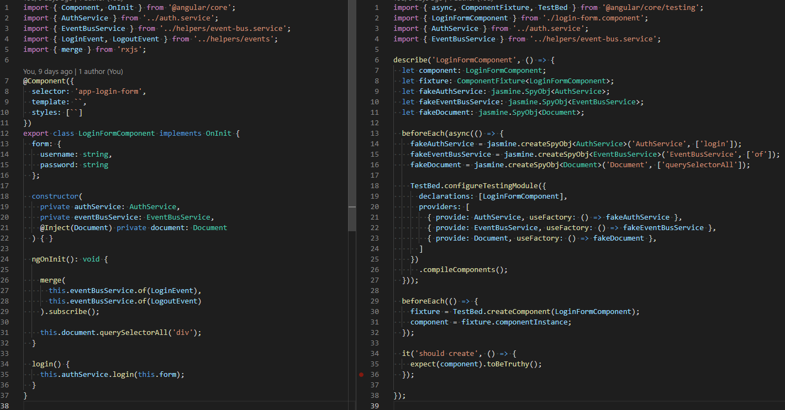
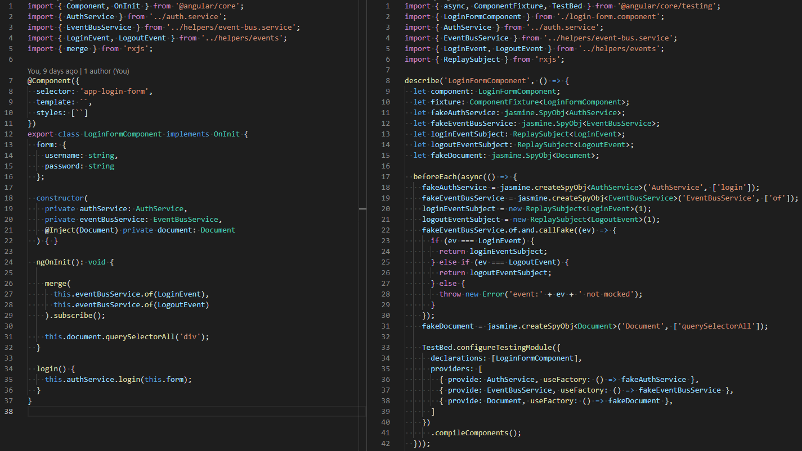

# Jasmine unit test generator

Automates creation of initial unit test files taking dependencies into account.

Supported types:

* component: [source](spec/fixtures/components/login-form.component.ts), [generated spec](spec/fixtures/components/login-form.component.spec.expected.ts), [generated spec with custom handler](spec/fixtures/components/login-form.component.spec.expected.with-handlers.ts)
* directive
* service: [source](spec/fixtures/auth.service.ts), [generated spec](spec/fixtures/auth.service.spec.expected.ts)
* service (double quote): [source](spec/fixtures/auth.service.with-double-quote.ts), [generated spec](spec/fixtures/auth.service.with-double-quote.spec.expected.ts)
* pipe
* class file (may not be useful depending on use case)

## Preview

Basic input/output example: 

With custom event bus service dependency handler:

## Usage

### Installation

run `npm i jasmine-unit-test-generator`

### Basic

run `jasmine-unit-test-generator <path-to-file>`

### With custom dependency handlers:

run `jasmine-unit-test-generator --handlers <path-to-handlers-dir> <path-to-file>`

### With dependency handlers written in typescript:

install `ts-node` 

run `jasmine-unit-test-generator --require ts-node/register --handlers <path-to-handlers-dir> <path-to-file>`

At the moment argument order is important!

And note that if you install generator globally, ts-node must be installed globally as well. Otherwise both need to be installed locally in the project.

## Dependency handlers

You can extend formatting of resulting spec files for each dependency by making a dependency handler. See [default-dependency-handler.ts](./src/default-dependency-handler.ts) and [event-bus.service.handler.ts](./spec/fixtures/dependency-handlers/event-bus.service.handler.ts)

It is possible to add extra declarations, initializers and dependencies.

## Development

It's probably best to:

* add an input file in `spec/fixtures` folder, e.g. test.ts
* add expected output file, e.g. test.spec.expected.ts
* link them in integration.spec.ts

Alternavely, you can:

* run `npm link`
* run `npm run build:dev`
* run `jasmine-unit-test-generator <option>` in your project of choice

## Release

run `npm run build`

run `npm publish`
